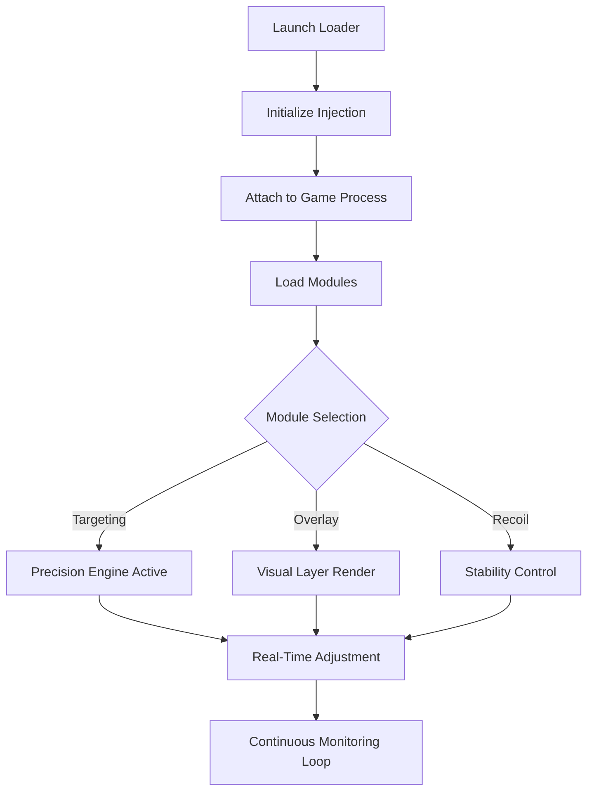

# Strinova Cheat Menu

A structured enhancement environment built for controlled gameplay modification on Windows platforms. This software focuses on direct injection logic, configurable overlays, and adjustable combat parameters — without bloated interfaces or unstable loaders.

Strinova Cheat Menu is designed as a modular runtime control system. Every feature is isolated, switchable, and adjustable in real time. The result is a clean operational layer that prioritizes performance stability and rapid configuration.

---

## Why This Software Exists

Competitive environments demand precision. Reaction time, visibility, recoil management — these variables determine outcome.

This system introduces:

* Configurable targeting behavior
* Adjustable recoil suppression
* Spatial awareness overlays
* Resource tracking panels
* Performance-safe injection logic

Instead of fragmented tools, Strinova Cheat Menu consolidates functionality into a single structured interface.

---

## Core Operational Modules

### Precision Targeting Engine

A configurable aiming layer with:

* FOV radius scaling
* Smoothness curve tuning
* Bone selection priority
* Target distance filters
* Visibility checks

Fine-grain sliders allow numeric adjustment rather than generic presets.

---

### Visual Awareness Layer

Overlay system providing:

* Player box highlights
* Health and armor display
* Distance markers
* Snapline alignment
* Color customization

Rendering is optimized to reduce frame drops during high-density scenes.

---

### Recoil & Spread Control

Dedicated module for weapon stability:

* Horizontal recoil compensation
* Vertical recoil limiter
* Spread tightening
* Burst smoothing logic

Each weapon profile can be adjusted independently and saved.

---

### Tactical Resource Monitoring

Integrated panel tracking:

* Ammo count adjustments
* Cooldown timers
* Item indicators
* Objective markers

Designed to reduce UI clutter while increasing tactical clarity.

---

[!IMPORTANT]
All modules are independently toggleable. Users can disable visual overlays while maintaining precision modules, or isolate recoil control without enabling targeting logic.

---

## Installation & Activation Flow

### Step 1 — Acquire Package

Download the compiled loader package.

### Step 2 — Extract Securely

Place files in a controlled directory with administrative access.

### Step 3 — Launch Injector

Run the executable before launching the game environment.

### Step 4 — Attach to Process

Select the active game process from the injector panel.

### Step 5 — Configure Modules

Use in-app sliders and toggles to define operational behavior.

---

## Runtime Logic Diagram

This logic ensures controlled execution. Modules are injected once and then governed by an internal monitoring loop for stability.

---

## Configuration Depth

Strinova Cheat Menu avoids fixed presets. Instead, it enables numeric and behavioral customization:

| Setting Category | Adjustable Range | Save Profiles | Hotkey Bind |
| ---------------- | ---------------- | ------------- | ----------- |
| FOV Radius       | 1–360            | Yes           | Yes         |
| Smoothness       | 0–100            | Yes           | Yes         |
| Recoil Scale     | 0–200%           | Yes           | Yes         |
| Overlay Opacity  | 0–100%           | Yes           | Yes         |

Profiles can be exported and reloaded without reinstalling.

---

## Performance Behavior

The system is engineered for:

* Low CPU overhead
* Minimal memory footprint
* Optimized DirectX overlay rendering
* Stable injection persistence

Internal monitoring prevents repeated injection attempts, reducing crash risk.

---

## Operational Use Case

Example scenario:

1. Activate precision module with moderate smoothness.
2. Enable player highlight overlays only within 150 meters.
3. Apply 40% vertical recoil suppression.
4. Save as “Competitive Profile.”

During gameplay, a single hotkey toggles full configuration.

---

## Frequently Asked Questions

**Does the software require constant reconfiguration?**
No. Profiles persist between sessions and can be exported.

**Is each module dependent on others?**
No. Targeting, overlays, and recoil systems operate independently.

**Can overlay colors be modified?**
Yes. RGB values and opacity sliders are available.

**Is keyboard-only control supported?**
Yes. Full navigation without mouse input is implemented.

---

## Structural Advantages

* Isolated module design
* Numeric precision control
* Clean injection workflow
* Adjustable visual rendering
* Profile-based configuration

The architecture favors structured control rather than aggressive automation.

---

## Closing Overview

Strinova Cheat Menu functions as a controlled enhancement framework. It focuses on precision logic, visual clarity, and recoil management without overloading system resources.

For users requiring direct parameter control and modular operation, this software provides a structured environment optimized for Windows x64 systems.

Access the package, configure the modules, and operate with defined precision.

---

## Key Word

Strinova Cheat Menu free download 2026, Strinova mod tool Windows, Strinova precision engine, Strinova recoil control software, Strinova overlay system, Strinova injector x64, Strinova targeting configuration

---
